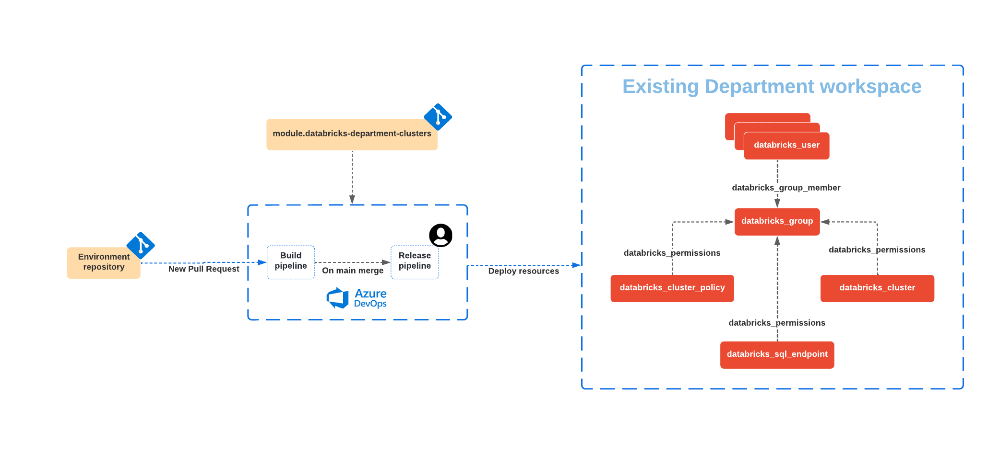

# terraform-databricks-examples

This repository contains multiple examples of implementing CI/CD pipelines to deploy Databricks resources using Terraform.

## General workflow

The general workflow for examples looks as following:

* Changes to code are made in a separate Git branch & when changes are ready, a pull request is opened
* Upon opening of the pull request, the build pipeline is triggered, and following operations are performed:
  * Initializes Terraform using a remote backend to store a [Terraform state](https://www.terraform.io/language/state).
  * Perform check of the Terraform code for formatting consistency.
  * Performs check of the Terraform code using [terraform validate](https://www.terraform.io/cli/commands/validate).
  * Executes `terraform plan` to get the list changes that will be made during deployment.
* If the build pipeline is executed without errors, results of `terraform plan` and the code could be reviewed by reviewer, and merged into the `main` branch.
* When code is merged into the `main` branch, the release pipeline is triggered, and after a manual approval, changes are applied to the deployment using the `terraform apply` command.

## Repository organization & implemented solutions

Code in the repository is organized into following folders:

* `modules` - implementation of specific Terraform modules:
  * [databricks-department-clusters](modules/databricks-department-clusters/) - Terraform module that creates Databricks resources for a team.
* `environments` - specific instances that use Terraform modules, providing CI/CD capabilities for deployment. Refer to `README.md` files inside specific folder:
  * [databricks-department-clusters-pat](environments/databricks-department-clusters-pat) - implementation of `databricks-department-clusters` module using authentication with Databricks personal access token (PAT). 
